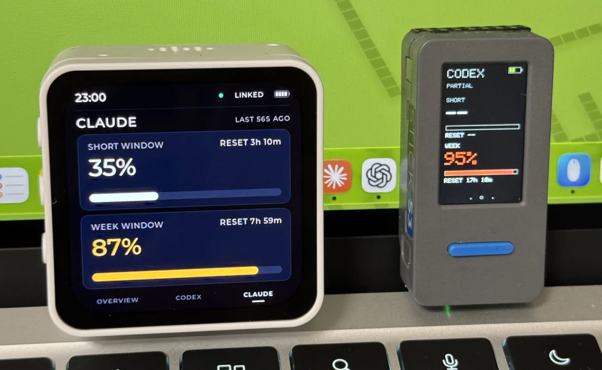
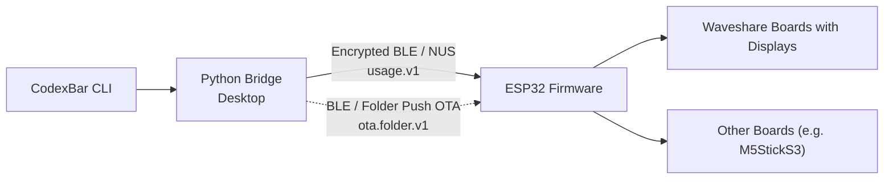
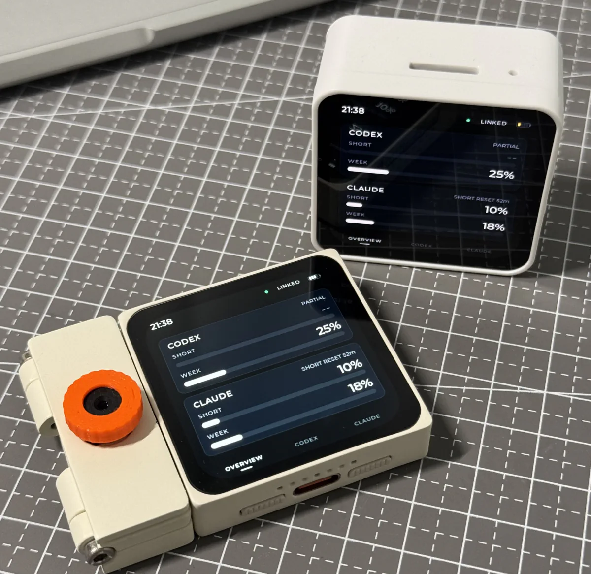

# QuotaFrame

**English** | [简体中文](README.zh-CN.md)

**Your AI coding limits, at a glance.**

  

QuotaFrame displays Codex and Claude usage percentages and quota reset countdowns on a dedicated desktop display.

QuotaFrame Bridge runs on your computer and syncs usage from CodexBar / Win-CodexBar over Bluetooth, keeping your quota status in view.

The data source handles account sign-in and usage retrieval. Bridge sends only usage percentages, reset times, and sample timestamps to the device; it does not transmit account credentials. See the [protocol documentation](protocol/README.md) for the data fields.

## Supported Devices

| Device | Display | Key Features |
| --- | --- | --- |
| Waveshare AMOLED 2.16 | 480×480 AMOLED | Touchscreen, clock screensaver, auto-rotation |
| M5StickS3 | 135×240 LCD | Button navigation, compact size |
| Waveshare ePaper 3.97 | 800×480 e-paper with four grayscale levels | Temperature and humidity, usage trends (SD card required) |
| ESP-Mosaico | 480×480 AMOLED | Touchscreen, AI button, auto-rotation |

All devices support Codex / Claude usage display, retain the last usage data when disconnected, and support firmware updates over Bluetooth. See the [device guide](docs/devices.md) for a full feature comparison and control shortcuts.

  

## Quick Start

### 1. Flash the Firmware

Open the [web flasher](https://quotaframe.com/) in Chrome or Edge on your computer, select your device model, connect it via USB, and follow the instructions. No ESP-IDF installation is required.

For manual flashing or serial recovery, see the [firmware guide](firmware/README.md#烧录和串口日志).

### 2. Set Up a Data Source

| Platform | Data Source | Setup |
| --- | --- | --- |
| Windows | [Win-CodexBar CLI](https://github.com/nesszer/Win-CodexBar) | Bridge downloads the CLI automatically if it is missing, or you can use a local installation. Your accounts must already be signed in. |
| macOS | [CodexBar](https://github.com/steipete/CodexBar) | Install the app and configure your accounts, then select Preferences → Advanced → Install CLI in the app. |

### 3. Install Bridge and Add a Device

Download the package for your platform from [Releases](https://github.com/eMUQI/QuotaFrame/releases/latest). No Python installation is required.

- **Windows**: Download and run `quotaframe-bridge-windows-v<version>-setup.exe`, then follow the installation wizard. You can also run the portable `.exe` directly. After launching Bridge, right-click its system tray icon to open the menu.
- **macOS (Apple Silicon only)**: Open the `.dmg`, drag `QuotaFrame Bridge.app` into Applications, and launch it. If macOS blocks the app, go to System Settings > Privacy & Security, click Open Anyway, and confirm Open. Right-click the menu bar icon to open the menu.

Select “Add Device” from the menu and follow the pairing instructions. On Windows, enter the six-digit pairing code shown on the device screen. On macOS, follow the system prompts. Bridge syncs usage automatically after pairing.

See the [Bridge guide](bridge/README.md) for installation and connection troubleshooting. You can start subsequent firmware updates from the Bridge menu; confirmation is required on both the computer and the device.

## User and Developer Documentation

| Document | Contents |
| --- | --- |
| [Device guide](docs/devices.md) | Feature comparison, touchscreen settings, and control shortcuts |
| [Bridge guide](bridge/README.md) | Installation troubleshooting, pairing, configuration, and daily use |
| [Firmware guide](firmware/README.md) | Manual flashing, building from source, and firmware testing |
| [Contributing guide](CONTRIBUTING.md) | Getting started with development, testing, and contribution requirements |
| [Open device access contract](protocol/open-device-access.md) · [Hardware porting](docs/PORTING.md) | Third-party device integration and support for new boards |
| [Roadmap and documentation index](docs/roadmap.md) · [Design guidelines](docs/design/amoled-ui.md) | Development direction, technical documentation, and UI guidelines |

## Acknowledgments

Thanks to Waveshare for supporting this project through sponsorship.

Usage data is provided by [CodexBar](https://github.com/steipete/CodexBar) and [Win-CodexBar](https://github.com/nesszer/Win-CodexBar). Thanks to [esp-desktop-buddy](https://github.com/espressif/esp-desktop-buddy), [LVGL](https://github.com/lvgl/lvgl), [Bleak](https://github.com/hbldh/bleak), [pystray](https://github.com/moses-palmer/pystray), [Pillow](https://github.com/python-pillow/Pillow), and [PyObjC](https://github.com/ronaldoussoren/pyobjc) for supporting the firmware and desktop application.

## License

The project code is licensed under [MPL-2.0](LICENSE). See [THIRD_PARTY_LICENSES.md](THIRD_PARTY_LICENSES.md) for third-party components and their licenses.
