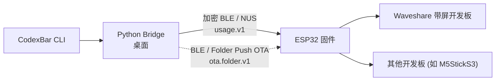

# QuotaFrame

[English](README.md) | **简体中文**

**Your AI coding limits, at a glance.**

  

AI 编码额度，抬眼即见。QuotaFrame 将 Codex 和 Claude 的已用百分比与配额重置倒计时显示在独立桌面屏上。

电脑端 QuotaFrame Bridge 通过蓝牙同步 CodexBar / Win-CodexBar 获取的用量，让配额状态常驻视野。

账号登录与用量获取由数据源负责。Bridge 仅向设备发送用量百分比、重置时间与采样时间，不传输账号凭据；字段范围见[协议说明](protocol/README.md)。

## 支持设备

| 设备 | 屏幕 | 主要特色 |
| --- | --- | --- |
| Waveshare AMOLED 2.16 | 480×480 AMOLED | 触屏、时钟屏保、自动旋转 |
| M5StickS3 | 135×240 LCD | 按键翻页、小尺寸 |
| Waveshare ePaper 3.97 | 800×480 四灰阶墨水屏 | 温湿度、用量趋势（需 SD 卡） |
| ESP-Mosaico | 480×480 AMOLED | 触屏、AI 键、自动旋转 |

所有设备均支持 Codex / Claude 用量显示、断连保留最后用量与蓝牙固件更新。完整功能对照及快捷操作见[设备说明](docs/devices.md)。

  

## 快速上手

### 1. 烧录固件

使用桌面版 Chrome 或 Edge 打开 [Web 烧录器](https://quotaframe.com/)，选择手中的设备型号、连接 USB，按页面提示烧录，无需安装 ESP-IDF。

需要手工烧录或串口恢复时，参阅[固件说明](firmware/README.md#烧录和串口日志)。

### 2. 准备数据源

| 平台 | 数据源 | 准备工作 |
| --- | --- | --- |
| Windows | [Win-CodexBar CLI](https://github.com/nesszer/Win-CodexBar) | Bridge 缺少 CLI 时会自动下载，也可使用本机 CLI；账号需已登录 |
| macOS | [CodexBar](https://github.com/steipete/CodexBar) | 安装并配置账号后，在应用内执行 Preferences → Advanced → Install CLI |

### 3. 安装 Bridge 并添加设备

从 [Releases](https://github.com/eMUQI/QuotaFrame/releases/latest) 下载对应平台的包，无需 Python 环境。

- **Windows**：下载安装器 `quotaframe-bridge-windows-v<version>-setup.exe` 并按向导安装，也可直接运行免安装版 `.exe`。启动后，右键系统托盘图标打开菜单。
- **macOS（仅 Apple Silicon）**：打开 `.dmg`，将 `QuotaFrame Bridge.app` 拖入 Applications 并启动。若被系统拦截，在「系统设置 > 隐私与安全性」点击「仍要打开」，再确认「打开」。右键菜单栏图标打开菜单。

在菜单中选择「添加设备」，按提示完成配对。Windows 需输入设备屏幕上的六位配对码；macOS 按系统弹窗操作。配对后 Bridge 会自动同步用量。

安装与连接问题见 [Bridge 说明](bridge/README.md)。日常固件更新可从 Bridge 菜单发起，需在电脑端与设备端分别确认。

## 使用与开发文档

| 文档 | 内容 |
| --- | --- |
| [设备说明](docs/devices.md) | 功能对照、触屏设置与快捷操作 |
| [Bridge 说明](bridge/README.md) | 安装排查、配对、配置与日常使用 |
| [固件说明](firmware/README.md) | 手工烧录、源码构建与固件测试 |
| [贡献指南](CONTRIBUTING.md) | 开发入口、测试与提交要求 |
| [开放接入契约](protocol/open-device-access.md) · [硬件移植](docs/PORTING.md) | 第三方设备接入与新开发板适配 |
| [开发路线与文档索引](docs/roadmap.md) · [设计规范](docs/design/amoled-ui.md) | 维护方向、技术文档与界面规范 |

## 致谢

感谢微雪电子对本项目的赞助支持。

用量数据依赖 [CodexBar](https://github.com/steipete/CodexBar) 与 [Win-CodexBar](https://github.com/nesszer/Win-CodexBar)。感谢 [esp-desktop-buddy](https://github.com/espressif/esp-desktop-buddy)、[LVGL](https://github.com/lvgl/lvgl)、[Bleak](https://github.com/hbldh/bleak)、[pystray](https://github.com/moses-palmer/pystray)、[Pillow](https://github.com/python-pillow/Pillow) 与 [PyObjC](https://github.com/ronaldoussoren/pyobjc) 提供固件及桌面端支持。

## 许可证

项目代码采用 [MPL-2.0](LICENSE)。第三方组件及其许可见 [THIRD_PARTY_LICENSES.md](THIRD_PARTY_LICENSES.md)。
