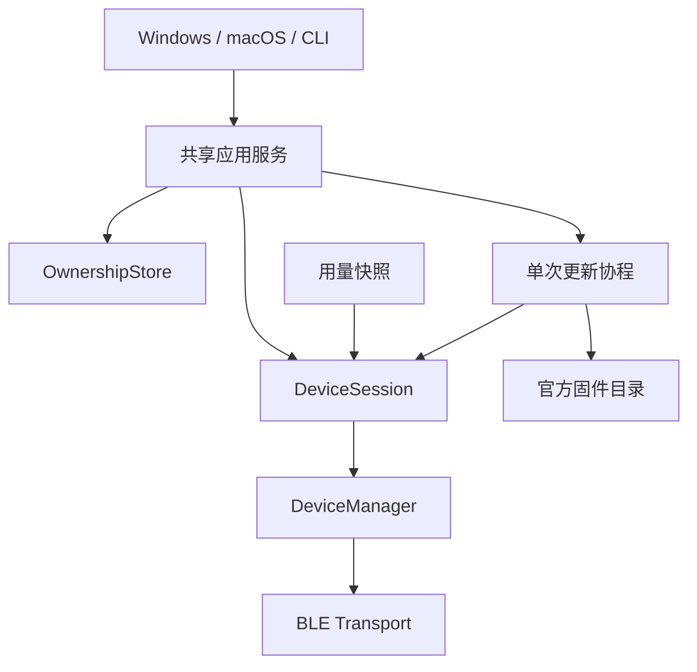

# 设备接入架构

线上字段和类型见[开放接入契约](../../protocol/open-device-access.md)。本文说明 Bridge、设备和发布服务的职责，以及维护实现时必须保持的状态边界。

## 职责

| 部分 | 职责 |
| --- | --- |
| Bridge | 采集并标准化用量、管理设备记录与会话、分发快照、编排用户操作与更新 |
| 设备 | 校验数据、显示最后有效状态、本地交互、时间管理、电源与容量检查、镜像写入与启动检查 |
| 发布服务 | 提供固定版本资产与官方固件目录；不可用时不影响日常用量同步 |

设备自行决定页面和交互；Bridge 发送上一页、下一页或时钟切换意图。第三方设备实现安全 BLE、status 和 `usage.v1` 即可接入，无需加入官方 Target Registry。Registry 只定义仓库维护目标的构建、分区、资产和官方更新元数据。

## 连接与状态归属



- 新设备按 `QF-<名称>` 和 NUS UUID 预筛；完成安全连接和 status 校验后才认领。添加由用户发起；广播名与 NUS 信息可分别到达，取消的设备只在本次添加流程中跳过。
- 平台地址是本机记录和操作路由键。广播名和自报名称可以重复，不能用作唯一身份。
- DeviceManager 管理连接、协商与清理；DeviceSession 管理快照、操作调度和单设备独占。
- 回调与更新操作保存 session/transport 对象引用，并核对它们仍是该地址的当前对象。同地址重新添加产生新会话，旧回调失效。
- GUI 与修改型 CLI 共用单实例锁；只读列表可读取原子文件快照。

## 设备记录

`devices.json` 使用 `schema_version: 1`，设备条目包括 `address`、`name`、非负整数 `added_at`，以及可省略的 `firmware_project` 和 `target`。名称与标识复用线上校验；未知但合法的型号保留。

OwnershipStore 是唯一写入口。重复键、未知字段、错误版本或类型、重复地址以及任一非法条目使整份文件读取失败并禁止覆盖。文件不存在表示空列表。持久化采用原子替换，成功后才发布对应的内存状态和操作结果。

能力、固件版本、候选镜像、用户确认和协程阶段不写入设备文件。更新判断使用当前安全 status；保存的项目与型号只用于离线展示。有效 status 更新名称与元数据，持久化失败显示记录保存错误。忘记设备删除应用记录并停止会话，不隐式清除系统蓝牙绑定。

## 输入校验

固件 `usage_json` 与 `usage_protocol/src/buddy_input_guard.c` 在 Buddy getter 和命令路由之前校验 UTF-8、解码后的重复键、JSON 完整性、原始数值和字段类型。嵌套深度最多 32，拒绝嵌入 NUL。JSONL 以 LF 结束，支持分片 CRLF，完整 JSON 上限为 4096 字节。

Buddy 的 `get_u32` 会钳位或截断部分非法值，不能替代输入验证。链接器包装 `buddy_linebuf_feed` 与 `buddy_protocol_process_line`，保留上游 ACK 编码及处理器。该包装依赖固定私有布局；CMake 对固定版本的相关源码规范化换行并校验 SHA-256，升级 Buddy 时必须审查布局、包装保留和边界测试。来源见组件 manifest，不修改生成的 `managed_components`。

每条连接只有一个在途请求。无序号 status 与 Folder Push 依赖串行和超时断连；结果未知的命令不自动重发，旧 transport 的响应不能完成新连接的等待者。远程 `unpair` 未注册，设备本地恢复与系统蓝牙管理负责绑定处理。

## 固件更新

官方目录以 `firmware_project + target` 精确匹配，还需检查版本、镜像种类和容量。自报项目和型号防止正常设备误刷，不构成制造商认证。下载来源由受控发布配置决定，设备不能指定任意 URL。

```text
选择更新 → 查询目录并下载校验 → 桌面确认设备与产物
    → 进入独占并重新核对当前对象与身份 → 设备物理确认
    → 写入与镜像校验 → 重启 → 版本及 boot_valid 核对
```

下载与桌面确认期间继续日常同步。一个设备最多一个更新任务，其他设备独立运行。确认绑定具体会话和产物；设备、版本或摘要变化即结束操作。取消、失败或退出不保存可复用确认，也不自动续传。

更新仅写应用分区，不更改 bootloader 或分区表。SHA-256 提供完整性检查，不提供发布者签名认证。固件更新在准备和传输阶段支持用户取消；最后一个数据块确认后进入结果确认阶段，不再提供取消入口。取消后停止任务并执行设备端尽力清理，不保证回滚已经完成的更新。

实机覆盖与故障验收要求见[验证范围](../verification.md)和[验收清单](../validation/software-acceptance.md)。
